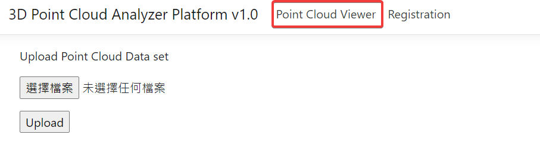
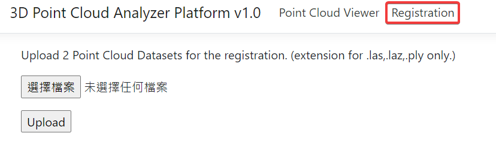
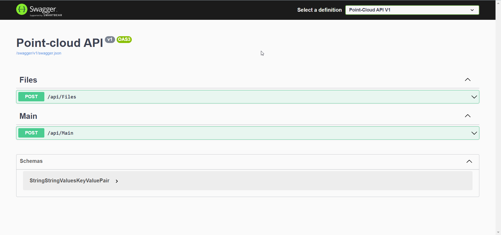
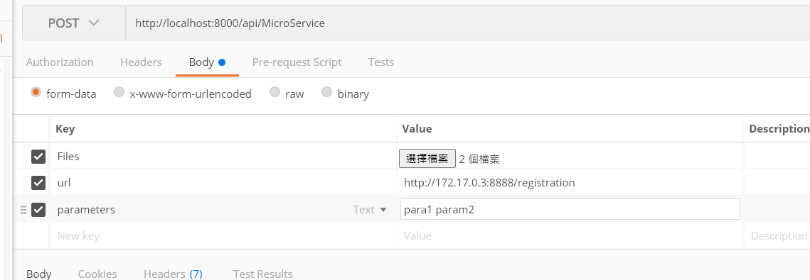
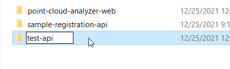
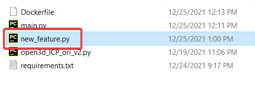

# 3D 點雲模型分析平台

## Getting Started
#### 確保主機已安裝 [docker](https://docs.docker.com/engine/install/ "docker") 環境

#### Clone the Repo
```shell
git clone "https://github.com/w110056005/point-cloud-analyzer-platform.git"
```

#### Docker build
##### main-web
``` shell
cd "path\to\repo\src\point-cloud-analyzer-web"
```
```shell
docker image build -t main-web .
```
##### sample-registration-api
``` shell
cd "path\to\repo\src\sample-registration-api"
```
```shell
docker image build -t registration-api .
```

Wait for build sucess. (Takes 15 mins each, due to the open3d installation)
#### Docker run
``` shell
docker run -d --rm -p 8000:80 main-web .
```
``` shell
docker run -d --rm -p 8001:8001 registration-api .
```

## Usage
Open browser and input http://localhost:8000/
可看到主頁面(UI為暫定，未來會做更改)

目前提供兩個功能
1. 直接呈現點雲模型


2. 點雲配準功能


#### Swagger
Enter http://localhost:8000/swagger

目前提供兩個controller
1. File 檔案上傳功能
2. MicroService 提供呼叫Microservice 並將回傳檔案轉為可視化模型功能


用POST 傳入參數
1. Files 欲處理之點雲模型
2. url MicroService 之路徑
3. parameters 執行該服務所需之指令參數



## Build your own Web Service
#### Python (Flask Web API)

1. 複製 Sample-registration-api 資料夾，並根據需要重新命名

2. 將準備好之程式複製到資料夾中


3. 打開main.py，更改相關程式碼
```python
@app.route('/**你的route路徑**', methods=['POST'])
def **你的method名稱**():
    files = request.files.getlist("file")
    ext = Path(files[0].filename).suffix
    for file in files:
        file.save(file.filename)

    output = **你的輸出檔案名稱**
    p = subprocess.run(
        [
            'python', '**你的程式名稱**', '**根據需求放入一至多個參數**'
        ]
    )
    return send_file(output, as_attachment=True)
```

4. 修改requirement.txt 或 Dockerfile，加入需要預先安裝的library
5. 重新執行 docker build 與 docker run


## Reference

使用 [Potree](https://github.com/potree/potree "Potree") 呈現點雲模型，並透過 [PotreeConverter v1.7](https://github.com/potree/PotreeConverter/releases/tag/1.7 "PotreeConverter v1.7") 進行轉檔

